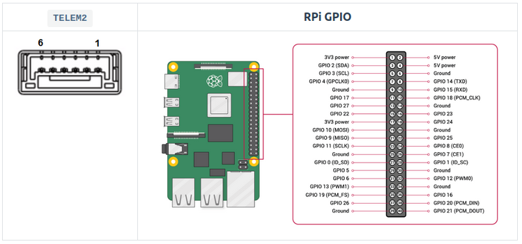

# Companion board

## [Raspberry PI 4](https://docs.px4.io/main/en/companion_computer/pixhawk_rpi.html#raspberry-pi-companion-with-pixhawk)

### Wiring

First wire up the serial connection between the RPi and PX4 that is to be used for offboard control.

This setup connects the Pixhawk TELEM2 port, which is generally recommended for offboard control. It is initially configured in PX4 to use with MAVLink, which we will change later when setting up ROS 2. Pixhawk ports can be located anywhere on the flight controller, but are almost always well labeled, and should be obvious on your particular flight controller.

Connect the Pixhawk TELEM2 TX/RX/GND pins to the complementary RXD/TXD/Ground pins on the RPi GPIO board:

| PX4 TELEM2 Pin | RPi GPIO Pin           |
| -------------- | ---------------------- |
| UART5_TX (2)   | RXD (GPIO 15 - pin 10) |
| UART5_RX (3)   | TXD (GPIO 14 - pin 8)  |
| GND (6)        | Ground (pin 6)         |

The diagram shows Pixhawk TELEM2 port pins on the left and RPi GPIO board pins on the right. The pins on the TELEM2 port are normally numbered right-to-left as shown.



### Ubuntu Setup on RPi

Install raspi-config:

```bash
sudo apt update
sudo apt upgrade
sudo apt-get install raspi-config 
```

Open raspi-config:

```bash
sudo raspi-config
```

Go to the Interface Option and then click Serial Port.

* Select No to disable serial login shell.
* Select Yes to enable the serial interface.
* Click Finish and restart the RPi.

Open the firmware boot configuration file in the nano editor on RaPi:

```bash
sudo nano /boot/firmware/config.txt
```

Append the following text to the end of the file (after the last line):

```bash
enable_uart=1
dtoverlay=disable-bt
```

Then save the file and restart the RPi.
In nano you can save the file using the following sequence of keyboard shortcuts: ctrl+x, ctrl+y, Enter.

Check that the serial port is available. In this case we use the following terminal commands to list the serial devices:

```bash
cd /
ls /dev/ttyAMA0
```

The result of the command should include the RX/TX connection /dev/ttyAMA0 (note that this serial port is also available as /dev/serial0).

The RPi is now setup to work with RPi and communicate using the /dev/ttyAMA0 serial port. Note that we'll install more software in the following sections to work with MAVLink and ROS 2.
